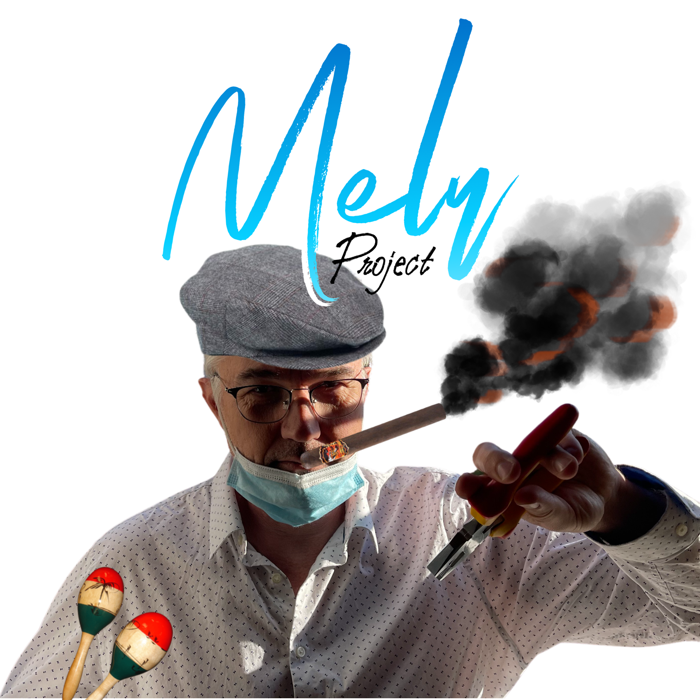

<div id="top"></div>
<!--
*** Thanks for checking out the Best-README-Template. If you have a suggestion
*** that would make this better, please fork the repo and create a pull request
*** or simply open an issue with the tag "enhancement".
*** Don't forget to give the project a star!
*** Thanks again! Now go create something AMAZING! :D
-->


<!-- PROJECT SHIELDS -->
<!--
*** I'm using markdown "reference style" links for readability.
*** Reference links are enclosed in brackets [ ] instead of parentheses ( ).
*** See the bottom of this document for the declaration of the reference variables
*** for contributors-url, forks-url, etc. This is an optional, concise syntax you may use.
*** https://www.markdownguide.org/basic-syntax/#reference-style-links
-->
[![Contributors][contributors-shield]][contributors-url]
[![Forks][forks-shield]][forks-url]
[![Stargazers][stars-shield]][stars-url]
[![Issues][issues-shield]][issues-url]
[![MIT License][license-shield]][license-url]
[![LinkedIn][linkedin-shield]][linkedin-url]


<!-- PROJECT LOGO -->
<br />
<div align="center">
  <a href="https://github.com/noxyz20/Melu">
    
  </a>

<h3 align="center">Melu</h3>

  <p align="center">
    Projet réalisé par les M2DFS du 14/10/2021 au 15/10/2021
    <br />
    <a href="https://github.com/noxyz20/Melu"><strong>Explorer la documentation »</strong></a>
    <br />
    <br />
    <a href="https://github.com/noxyz20/Melu">Voir la Démo</a>
    ·
    <a href="https://github.com/noxyz20/Melu/issues">Signaler un Bug</a>
    ·
    <a href="https://github.com/noxyz20/Melu/issues">Proposer une Fonctionnalité</a>
  </p>
</div>


<!-- TABLE OF CONTENTS -->
<details>
  <summary>Sommaire</summary>
  <ol>
    <li>
      <a href="#about-the-project">À propos</a>
      <ul>
        <li><a href="#built-with">Construit Avec</a></li>
      </ul>
    </li>
    <li>
      <a href="#getting-started">Pour commencer</a>
      <ul>
        <!-- <li><a href="#prerequisites">Prérequis</a></li> -->
        <li><a href="#installation">Installation</a></li>
      </ul>
    </li>
    <!-- <li><a href="#usage">Utilisation</a></li> -->
    <li><a href="#roadmap">Roadmap</a></li>
    <!-- <li><a href="#contributing">Contribuer</a></li> -->
    <!-- <li><a href="#license">License</a></li> -->
    <li><a href="#contact">Contact</a></li>
    <li><a href="#acknowledgments">Remerciements</a></li>
  </ol>
</details>


<!-- ABOUT THE PROJECT -->
## À propos

[![Logo][product-screenshot]](https://github.com/noxyz20/Melu/blob/main/images/logo.png?raw=true)

<!-- Here's a blank template to get started: To avoid retyping too much info. Do a search and replace with your text editor for the following: `noxyz20`, `Melu`, `bdc_ca`, `frédéric-colin-4557bb1`, `bdc.contact.twitch@gmail.com`, `bdc.contact.twitch@gmail.com`, `Melu`, `Projet réalisé par les M2DFS du 14/10/2021 au 15/10/2021` -->

<p align="right">(<a href="#top">Vers le haut ↑</a>)</p>


### Construit Avec

* [Visual Studio 2019 Professional](https://visualstudio.microsoft.com/fr/downloads/)
* [.NET 5](https://dotnet.microsoft.com/download/dotnet/5.0)
* [Application Windows Form](https://docs.microsoft.com/fr-fr/visualstudio/ide/step-1-create-a-windows-forms-application-project?view=vs-2019)
* [Pixlr](https://pixlr.com/fr/)
* [GitHub](https://github.com/noxyz20/Melu)

<p align="right">(<a href="#top">Vers le haut ↑</a>)</p>


<!-- GETTING STARTED -->
## Pour commencer

<!-- This is an example of how you may give instructions on setting up your project locally.
To get a local copy up and running follow these simple example steps. -->

<!-- ### Prérequis

This is an example of how to list things you need to use the software and how to install them.
* npm
  ```sh
  npm install npm@latest -g
  ``` -->

### Installation

<!-- 1. Get a free API Key at [https://example.com](https://example.com)
2. Clone the repo
   ```sh
   git clone https://github.com/noxyz20/Melu.git
   ```
3. Install NPM packages
   ```sh
   npm install
   ```
4. Enter your API in `config.js`
   ```js
   const API_KEY = 'ENTER YOUR API';
   ``` -->
1. Cloner le repo
   ```sh
   git clone https://github.com/noxyz20/Melu.git
   ```

<p align="right">(<a href="#top">Vers le haut ↑</a>)</p>


<!-- USAGE EXAMPLES -->
<!-- ## Utilisation

Use this space to show useful examples of how a project can be used. Additional screenshots, code examples and demos work well in this space. You may also link to more resources.

_For more examples, please refer to the [Documentation](https://example.com)_

<p align="right">(<a href="#top">Vers le haut ↑</a>)</p> -->


<!-- ROADMAP -->
## Roadmap

- [] Création du Front
- [] Création du Back
- [] Liaison du Front avec le Back
    - [] Déployer l'application

Visionnez les [bugs connus](https://github.com/noxyz20/Melu/issues) pour une liste complète des fonctionnalités proposées (et les bugs connus)

<p align="right">(<a href="#top">Vers le haut ↑</a>)</p>


<!-- CONTRIBUTING -->
<!-- ## Contribuer

Contributions are what make the open source community such an amazing place to learn, inspire, and create. Any contributions you make are **greatly appreciated**.

If you have a suggestion that would make this better, please fork the repo and create a pull request. You can also simply open an issue with the tag "enhancement".
Don't forget to give the project a star! Thanks again!

1. Fork the Project
2. Create your Feature Branch (`git checkout -b feature/AmazingFeature`)
3. Commit your Changes (`git commit -m 'Add some AmazingFeature'`)
4. Push to the Branch (`git push origin feature/AmazingFeature`)
5. Open a Pull Request

<p align="right">(<a href="#top">Vers le haut ↑</a>)</p> -->


<!-- LICENSE -->
<!-- ## License

Distributed under the MIT License. See `LICENSE.txt` for more information.

<p align="right">(<a href="#top">Vers le haut ↑</a>)</p> -->


<!-- CONTACT -->
## Contact

BDC - [@bdc_ca](https://twitter.com/bdc_ca) - bdc.contact.twitch@gmail.com

Lien du projet : [https://github.com/noxyz20/Melu](https://github.com/noxyz20/Melu)

<p align="right">(<a href="#top">Vers le haut ↑</a>)</p>


<!-- ACKNOWLEDGMENTS -->
## Remerciements

* [Frédéric Colin](https://www.linkedin.com/in/fr%C3%A9d%C3%A9ric-colin-4557bb1/)
<!-- * []()
* []() -->

<p align="right">(<a href="#top">Vers le haut ↑</a>)</p>


<!-- MARKDOWN LINKS & IMAGES -->
<!-- https://www.markdownguide.org/basic-syntax/#reference-style-links -->
[contributors-shield]: https://img.shields.io/github/contributors/noxyz20/Melu.svg?style=for-the-badge
[contributors-url]: https://github.com/noxyz20/Melu/graphs/contributors
[forks-shield]: https://img.shields.io/github/forks/noxyz20/Melu.svg?style=for-the-badge
[forks-url]: https://github.com/noxyz20/Melu/network/members
[stars-shield]: https://img.shields.io/github/stars/noxyz20/Melu.svg?style=for-the-badge
[stars-url]: https://github.com/noxyz20/Melu/stargazers
[issues-shield]: https://img.shields.io/github/issues/noxyz20/Melu.svg?style=for-the-badge
[issues-url]: https://github.com/noxyz20/Melu/issues
[license-shield]: https://img.shields.io/github/license/noxyz20/Melu.svg?style=for-the-badge
[license-url]: https://github.com/noxyz20/Melu/blob/master/LICENSE.txt
[linkedin-shield]: https://img.shields.io/badge/-LinkedIn-black.svg?style=for-the-badge&logo=linkedin&colorB=555
[linkedin-url]: https://linkedin.com/in/frédéric-colin-4557bb1
[product-screenshot]: images/logo.png